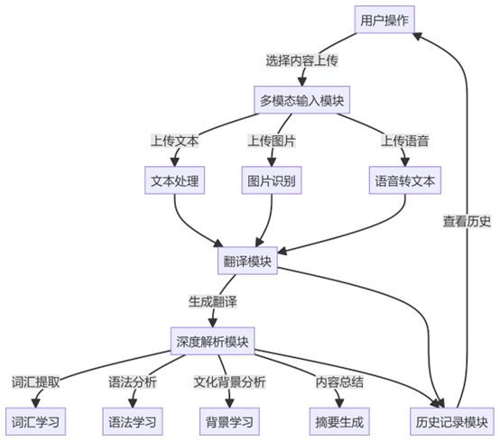
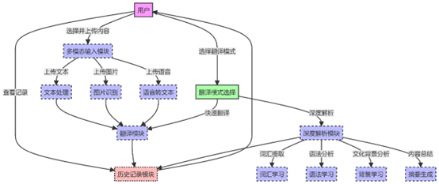
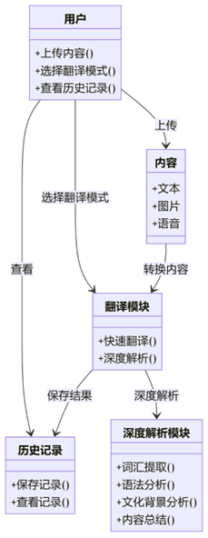
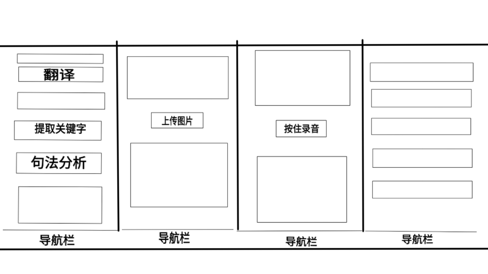

# 本次汇报内容

## 项目背景与意义

在本次软件工程项目开展之前，我们小组通过头脑风暴对多个项目选题进行了讨论，最终一致决定在微信小程序平台上开发一款基于大模型的翻译精读程序。随着大模型技术的迅速发展，语言处理的能力大幅提升，为外语学习者提供了更为丰富的学习工具。我们认为，利用这些先进技术，可以将传统的翻译工具转化为一个不仅支持基本翻译功能，还能够进行深入文本分析和个性化学习的辅助工具。

外语学习者在日常学习中，常常需要处理大量的外语文本，例如阅读《经济学人》等外刊。这些高质量的材料对于提升语言能力、了解国际动态至关重要。然而，人工精读的效率低且难以满足学习者个性化的需求，传统方法在现代生活节奏中逐渐显得不够适用。由此，我们的项目旨在解决这一需求，以更高效、便捷的方式帮助学习者进行深度学习。

## NABCD分析

### **需求 Need**

外语学习者对于收集和理解原文信息有着强烈的需求。学习者不仅需要了解单词和句子的表面意思，还希望能够深入理解文本的语法、语境和文化背景。传统的翻译工具往往只能提供字面翻译，缺乏对文本深层次的解析，无法满足学习者的全面需求。

现代生活节奏加快，学习者需要一种更加便捷、快速的学习工具，能够随时随地进行语言学习。具体需求包括：

快速翻译：用户希望能够即时翻译和理解多种模态的语料输入。

深度解析：需要对文本进行语法分析、词汇提取和语境解读。

### ******方法**** Approach**

为了实现我们的目标，我们计划采取以下几种方法：

文本输入与解析：用户可以通过微信小程序上传或输入需要精读的多模态语料，系统会自动识别语料内容转化为可后期处理的文本。

大模型应用：利用大模型的强大自然语言处理能力，对输入的文本进行多层次的解析。这包括但不限于：

词汇提取：自动提取文本中的重要词汇，帮助学习者进行词汇学习。

语法分析：分析文本的句法结构，帮助学习者理解语法规则。

文化背景知识介绍：提供文本相关的文化背景信息，帮助学习者理解文本的语境及其背后的文化内涵。

内容总结：系统将自动对输入的文本进行总结，提取出关键观点和主要信息，形成简洁的内容摘要。

### ******好处**** Benefit**

通过将大模型与微信小程序结合，我们的项目能够为外语学习者提供以下好处：

1. 提升学习效率：通过自动化的文本精读，学习者能够在较短时间内掌握更多的语言知识。
2. 个性化学习：每位学习者都可以根据自身的需求选择适合的材料，系统会提供定制化的学习建议。
3. 便捷性：利用微信小程序的便携性，学习者可以在任何时间和地点进行学习多样模态的语料，灵活性大大增强。

### ******竞争**** Competitions**

我们的翻译精读程序面临多个竞争对手：

1. 传统翻译工具：许多传统翻译工具只能提供基本的翻译服务，无法进行深入分析，缺乏个性化的学习体验。
2. 现有学习应用：市面上已有不少外语学习应用，但许多应用往往侧重于基础知识，缺乏高阶学习的支持。
3. 纸质书籍和学习资料：虽然传统的纸质书籍在某些情况下仍有其优势，但对于快速学习和实时反馈的需求来说，纸质材料的局限性显而易见。

通过我们的项目，我们能够避开传统工具的不足，利用大模型的深度分析能力，提供一个全面、便捷的学习平台。

### ******推广**** Delivery**

为了有效推广我们的翻译精读程序，我们计划采取以下策略：利用微信的社交网络进行宣传，通过朋友圈、微信群等渠道扩大影响力。建立反馈渠道，例如发放调查问卷，鼓励用户分享使用体验，并在此基础上进行优化，提升用户忠诚度。组织线上线下活动，例如举行路演，邀请用户参与体验和讨论，增加产品曝光度。通过这些策略，我们期望能够快速推广我们的翻译精读程序，帮助更多外语学习者实现高效学习。

## 基本目标

本次项目的基本目标是实现一个支持多模态输入的外语翻译精读程序。为了实现这一目标，我们需要实现两大类功能，一是多模态输入的支持，二是对语料进行精读的支持。

对于多模态输入这一目标，我们计划支持文本、图片、语音三种模态，将其统一转化为文本供大模型处理。

对于语料精读这一目标，我们计划支持关键词提炼解释，句法分析，文化背景知识介绍，内容总结这些功能，借助提示词指导大模型输出格式化且易于阅读的学习材料。

此外，还需提供本地历史记录供用户回顾最近的语料，加强学习效果。

## 可行性分析

在项目基本目标分析后，本小组针对各个目标的要求、小组成员的能力以及项目开发平台的便利等因素进行了全面考量。经过仔细研究和讨论，我们认为当前的计划方案是可行的，具体分析如下：

技术可行性上本项目基于微信开发者工具进行小程序的开发，这使得技术实施相对简单。微信开发者工具提供了易于使用的WXML语言，用于图形界面的开发，同时支持可视化操作，极大地方便了界面设计。项目主要使用JavaScript作为开发语言。尽管小组成员对JavaScript的掌握尚浅，但其轻量级和易上手的特性为我们快速学习和应用提供了可能。我们可以通过网络获取免费的多媒体资源，减少了开发成本和时间。

对项目目标进行市场需求分析，我们认为外语学习市场对于翻译精读工具有着广阔的需求。用户习惯方面，许多外语学习者仍然需要依靠工具来提升自己的语言能力，而我们的项目恰好填补了这一空白。用户对于便捷、高效的学习工具的需求日益增加。竞争分析方面，虽然传统的翻译工具和现有的学习应用在市场上占据一定份额，但大多数工具缺乏个性化服务和深度分析功能。我们的产品将通过其独特的多模态支持和大模型分析能力脱颖而出。

本项目在经济成本上也具有较高的可行性。目的工作量相对较小，所需的经济成本并不高。利用微信小程序开发，无需购买昂贵的开发设备或软件。此外，成员可以在课余时间进行项目开发，不会对其他课程产生负担，从而确保项目进度的顺利推进。

## 人员分工管理

本小组共计有3成员。鉴于本次项目参与人员较少，但工程量比较大，我们决定采用民主制组织模式进行交流沟通，各自可以根据自身的能力以及对项目的期望，自由地选择想要负责的任务，最终的小组具体分工如下：

王志成：选题调研，整体框架设计，语料精读功能实现，测验代码，文档撰写。

杨金亮：选题调研，代码管理，多模态输入功能实现，历史记录实现，测验代码，文档撰写。

何佳宝：选题调研，前端界面实现与美化，测验代码，文档撰写。

## 需求分析

本项目旨在开发一款基于微信小程序的大模型驱动的翻译精读应用，以满足外语学习者的深度学习需求。随着大模型技术的发展，传统翻译工具已经无法完全满足学习者的个性化需求和对语境深层次的理解。该小程序不仅能提供即时翻译，还可进行多模态输入支持（包括文本、图片和语音），并具备深层文本解析功能，如语法分析、关键词提取、文化背景解读和内容总结，以便用户在日常生活中随时随地获取语言学习支持。最终，该应用旨在提升学习效率并增强用户的语言能力

| 模块       | 功能描述                                   | 用户操作             | 输出结果           |
| ---------- | ------------------------------------------ | -------------------- | ------------------ |
| 多模态输入 | 支持文本、图片、语音输入，自动识别并转换   | 上传文件或直接输入   | 转换后的文本内容   |
| 快速翻译   | 实现多语言即时翻译，支持多种语言之间的翻译 | 选择语言并进行翻译   | 翻译后的文本       |
| 深度解析   | 对输入文本进行词汇提取、语法分析和文化背景 | 点击“深度解析”按钮 | 解析后的文本信息   |
| 历史记录   | 保存并回顾用户已处理过的文本记录           | 查看历史记录         | 历史翻译与解析记录 |

## UML

**小程序用例图：**

* **用户角色** ：用户可以上传内容、选择翻译模式、查看历史记录等操作。
* **主要功能** ：上传内容可以选择文本、图片或语音，翻译模式可以选择快速翻译或深度解析，结果会保存在历史记录中供用户回顾。

**基于多模态输入的翻译小程序核心模块类图：**

用户通过调用上传内容方法与内容类交互，上传文本、图片或语音，触发内容处理过程。调用选择翻译模块方法与翻译模块交互，选择快速翻译或深度解析，并将结果传递给后续模块。在深度解析模式下，翻译模块将内容传递给深度解析模块，进行进一步的分析。

## 原型系统设计

### 草图

## 已经实现的部分

* 多模态输入
* 翻译与解析
* 主页和两个输入页

## 演示程序
